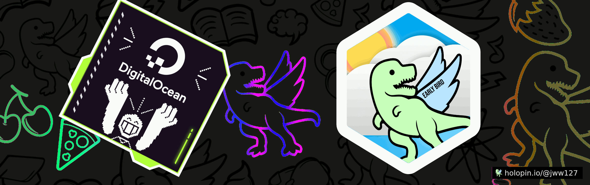

<!--  -->

 

 <!--  -->

 

<!--

-->
 
 

 <h3> Hello I'm Joey </h3>
  
 Rust and Typescript developer with a love for science fiction.  
 Constantly exploring and creating new projects.  
  
🖥️ My Site: <a href="https://joseph27.dev">Portfolio</a>  
📫 @me: <a href="https://twitter.com/SUPER_COOL_JOEY">Twitter</a>  
🎮 Chat: <a href="https://discordapp.com/users/1112861708336238623">Discord</a>  

 

